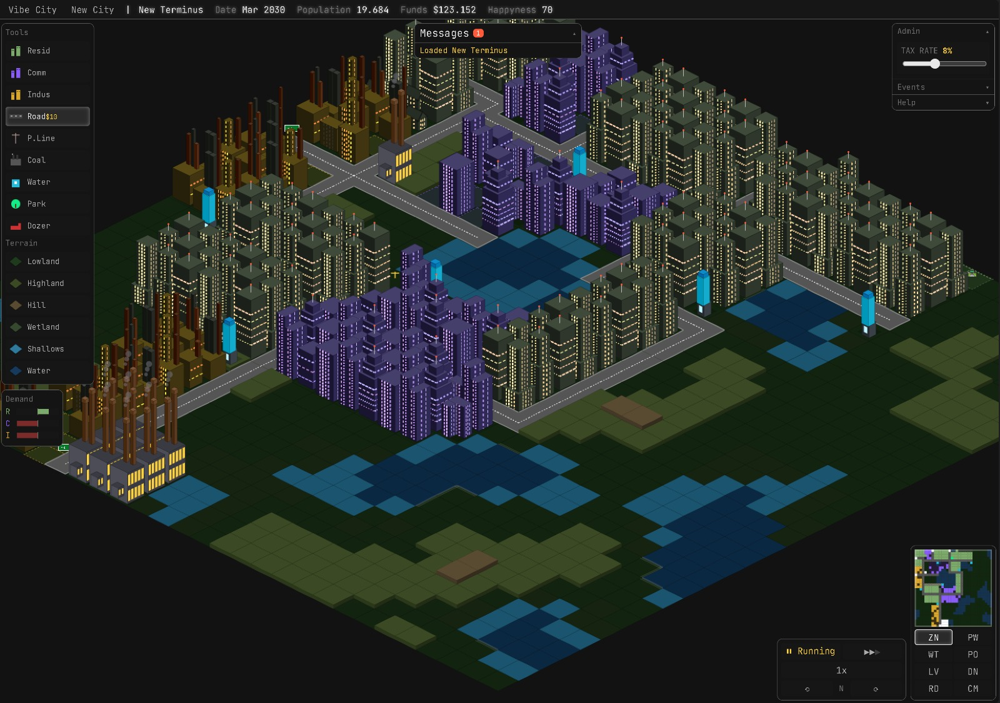
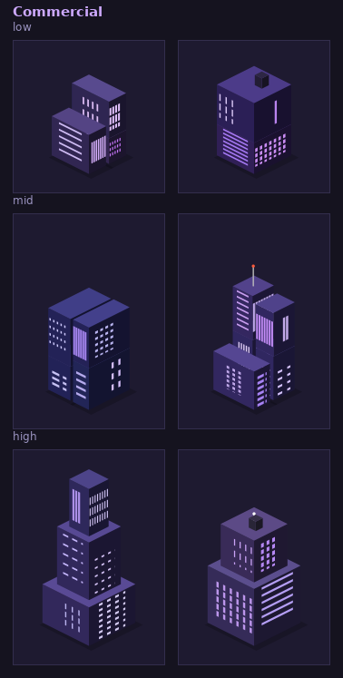
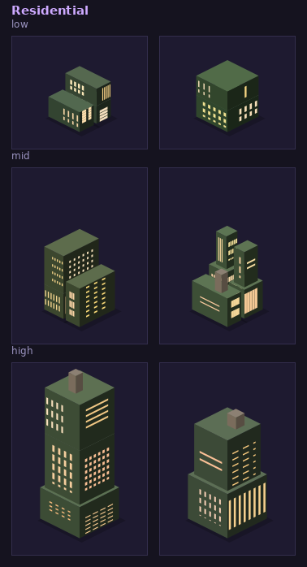
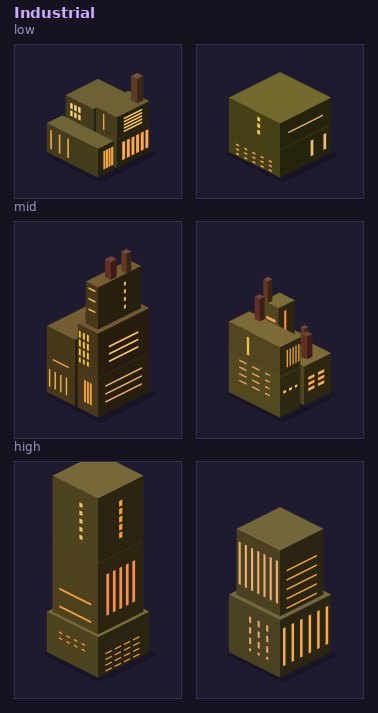
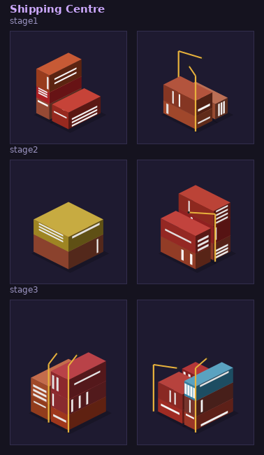
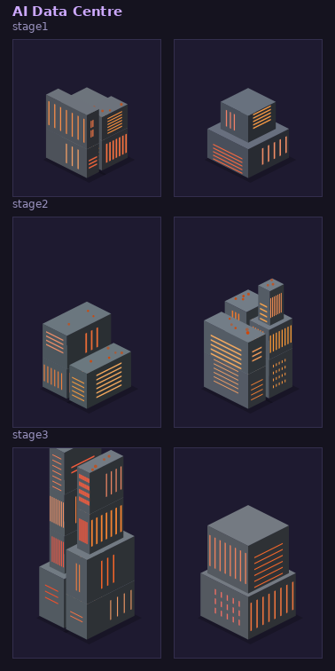
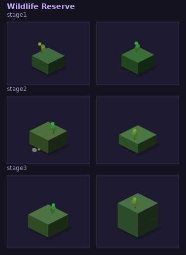

# Vibe City
A browser-based isometric city builder with a retro CRT aesthetic. Built with vanilla JavaScript ES modules, no build step required.

## Play it on itch.io
[Vibe City Web Version](https://phlehmann.itch.io/vibe-city)

## 🌃 🌆 🏙️ 🌉 🌁



## Running

Serve the project root over HTTP (required for ES modules):

```bash
npx serve .
# or
python3 -m http.server
```

Then open `http://localhost:3000` (or whichever port your server uses).

Opening `index.html` directly as a `file://` URL will not work due to module CORS restrictions.

## Controls

| Input | Action |
|---|---|
| Left-click / drag | Place selected tile |
| Right-click / drag | Bulldoze |
| Scroll wheel | Zoom in/out |
| Q / E | Rotate view |
| Space | Pause / resume |
| Fullscreen icon (top-right) | Toggle fullscreen |


## Project structure

```
index.html          entry point & static UI layout
css/
  ui.css            all styles (CRT/scanline theme, design tokens)
js/
  config.js         constants, tile IDs, tool catalogue, map sizes
  state.js          mutable game state, save/load, road mask logic
  simulation.js     monthly tick — RCI demand, budgets, power/water propagation
  terrain.js        procedural terrain generation & elevation tools
  renderer.js       isometric canvas renderer, minimap, bridge geometry
  input.js          mouse & keyboard handling, drag placement, terrain tools
  ui.js             toolbar, inspector, minimap strip, HUD sync, panels
  main.js           bootstrap & game loop
  assets.js         sprite asset registry
  export_assets.js  SVG asset export utility
scripts/
  gen-assets/       procedural draft-asset generators (see below)
```

## Map sizes

| Size | Grid |
|---|---|
| Small | 32×32 |
| Medium | 48x48 |
| Large | 64x64 |

## Features

- Isometric rendering with 4-direction rotation (N/E/S/W) and variable zoom
- RCI demand system (Residential / Commercial / Industrial) with tax rate control
- Power grid propagation from power plants via power lines
- Water pump coverage with road-access requirement
- Procedural terrain — elevation, moisture, wetlands, coasts, hills
- Bridges over water with ramp/span geometry
- Population milestone notifications (10k / 50k / 100k), persisted per city
- Collapsible notification centre with persistent warnings and transient events
- Tile inspector — shows type, power, water, road access, pollution on hover
- Minimap with overlay modes (normal, power, water, land value, fire)
- Autosave + 6 manual save slots to `localStorage`
- Fire disaster tool
- SVG asset export


## Building assets

Every zone (residential / commercial / industrial) and every scenario
contract type (AI data centre / shipping centre / wildlife reserve) is
rendered from SVGs procedurally generated by `scripts/gen-assets/` —
ground layout (single tower / twin / group-of-three / cluster) followed by
a stacked 2-4 block tower per lot, with randomized windows and wall/roof
shading. One script per zone, each with its own palette and rooftop
decorations (see `CLAUDE.md` for the full rundown):

```bash
node scripts/gen-assets/gen-commercial.mjs --count=6 --seed=1   # purple, antenna / utility box
node scripts/gen-assets/gen-residential.mjs --count=6 --seed=1  # olive-green, chimney / water tank
node scripts/gen-assets/gen-industrial.mjs --count=6 --seed=1   # yellow-brown, rooftop smokestacks
node scripts/gen-assets/gen-scenario.mjs --count=6 --seed=1     # AI data centre / shipping centre / wildlife reserve
```

Writes drafts to `assets/drafts/<zone>/<zone>_<tier>_{01..N}.svg` plus an
`index.html` contact sheet per folder for review (`assets/drafts/` is
gitignored). The currently-shipped set lives in `assets/buildings/`
(`{zone}_{density}_{a..f}.svg`) and `assets/scenario/`
(`{type}_{stage}_{a..f}.svg`) — to swap in a freshly generated batch,
rename the chosen `_01..06` files to `_a..f` and copy them into the
matching folder.









## Desktop builds (Tauri)

The game also ships as a native desktop app via [Tauri 2](https://v2.tauri.app/),
wrapping the same static `index.html` / `css/` / `js/` with no build step —
`src-tauri/tauri.conf.json` points `frontendDist` straight at the project root.

### Prerequisites

| Tool | macOS | Linux | Windows |
|---|---|---|---|
| Rust | `brew install rust` or [rustup.rs](https://rustup.rs) | [rustup.rs](https://rustup.rs) | [rustup.rs](https://rustup.rs) |
| Tauri CLI v2 | `cargo install tauri-cli --version "^2.0.0"` | same | same |
| System libs | — | `libwebkit2gtk-4.1-dev`, `libssl-dev`, `libayatana-appindicator3-dev`, `librsvg2-dev`, `patchelf`, `build-essential`, `libxdo-dev`, `pkg-config` (see `.github/workflows/release.yml`) | — |
| ImageMagick (icons) | `brew install imagemagick` | `sudo apt install imagemagick icnsutils` | `choco install imagemagick` (run icon script via Git Bash/WSL) |

### First-time icon setup

Bundle icons aren't committed yet — `cargo tauri build` will fail until you add them:

```bash
# 1. Drop a square 1024x1024 PNG at icons/source.png
# 2. Generate all sizes + icon.ico/icon.icns:
bash scripts/generate_icons.sh
```

See `icons/README.md` for details.

### Local development

```bash
cargo tauri dev      # launches the app with the webview pointed at the live source
```

### Production build (current platform only)

```bash
cargo tauri build
```

Output lands under `src-tauri/target/release/bundle/` (or
`src-tauri/target/<triple>/release/bundle/` for cross-targeted builds, e.g.
the macOS universal binary).

### Tag and release (triggers CI)

Pushing a tag matching `v*.*.*` runs `.github/workflows/release.yml`, which
builds Windows (`.exe` NSIS installer + portable `.zip`), macOS (`.app` +
universal `.dmg`), and Linux (`.deb` + `.AppImage`) in parallel, then
publishes everything as a GitHub Release:

```bash
git tag v1.0.0
git push origin v1.0.0
```

Code signing for macOS and Windows is **not configured** — both jobs have
clearly marked `TODO` placeholders for the required secrets. Unsigned builds
work fine locally and for distributing to testers, but macOS will show a
Gatekeeper warning and Windows will show an "unknown publisher" SmartScreen
prompt until signing is set up.

## Web build (itch.io)

The same static `index.html` / `css/` / `js/` / `assets/` also runs as-is in
a browser — no build step, same as running it locally with `npx serve .`.
`scripts/build-itch.mjs` packages a clean copy into a zip ready to upload to
itch as an HTML5 embed:

```bash
node scripts/build-itch.mjs
```

Output lands at `build/vibe-city-web-vX.Y.Z.zip` (version read from
`src-tauri/Cargo.toml`, `build/` is git-ignored). It stages `index.html`,
`css/`, `js/`, and `assets/` into a temp folder first — leaving out
`assets/drafts/` (gitignored review art, see "Building assets" above) and
everything Node/Tauri-only (`src-tauri/`, `scripts/`, `docs/`, this
README) — then zips it with `index.html` at the archive root, which itch's
HTML5 embed requires (a zip with everything nested one folder down won't
launch).

On the itch page, set the embed to fullscreen-capable ("automatically
calculate frame size" / mobile-unfriendly is fine) — the game already
handles arbitrary viewport sizes via a `window.resize` listener, and has
its own in-game fullscreen toggle (top-right of the statusbar, uses the
standard Fullscreen API) independent of itch's own fullscreen button.

Fonts are self-hosted (`assets/fonts/`, JetBrains Mono, SIL OFL license
included) rather than pulled from the Google Fonts CDN, so the web build
has no external network dependency at load time.
